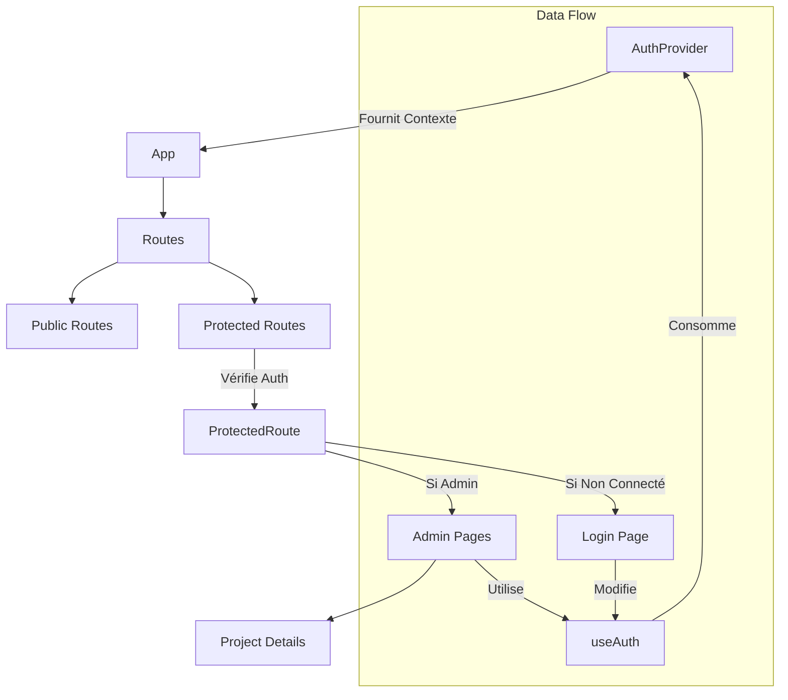

# Guide d'Implémentation : Authentification et Routes Imbriquées

Ce guide vous explique comment ajouter une fonctionnalité de connexion sécurisée à votre application React en utilisant `Context`, des `Hooks` personnalisés et `React Router`.

## Objectifs 🎯
1.  Gérer l'état de l'utilisateur (connecté/déconnecté) globalement avec **Context**.
2.  Créer un **Hook personnalisé** `useAuth` pour simplifier l'accès aux données.
3.  Protéger les routes d'administration via un composant wrapper.
4.  Maîtriser les Hooks avancés : `useParams`, `useEffect`, `useRef`.

---

## Vue d'Ensemble 🗺️

Voici comment les composants interagissent entre eux :



---

## Partie 1 : Authentification Simplifiée (`src/context/AuthContext.tsx`)

Nous utilisons un seul fichier pour tout gérer.

```tsx
import { createContext, useState, useEffect, useContext } from 'react';
import type { ReactNode } from 'react';

// ... (Code identique au précédent pour AuthContext)
```

*(Voir votre code source pour l'implémentation complète)*

---

## Partie 2 : Concepts Avancés 🚀

### 1. Routes Dynamiques avec `useParams`
Pour créer une page de détail (ex: `/admin/projects/123`), on utilise `useParams`.

**Configuration Route (`App.tsx`)** :
```tsx
<Route path="projects/:id" element={<AdminProjectDetails />} />
```

**Récupération ID (`AdminProjectDetails.tsx`)** :
```tsx
import { useParams } from 'react-router-dom';

export default function AdminProjectDetails() {
  const { id } = useParams(); // id vaudra "123"
  // ...
}
```

### 2. Le Cycle de Vie avec `useEffect`
Ce hook permet d'effectuer des actions à des moments précis.

- **Au montage seulement** (Comme `componentDidMount`) :
```tsx
useEffect(() => {
  console.log("Composant affiché !");
  fetchData();
}, []); // Tableau vide
```

- **Quand une variable change** :
```tsx
useEffect(() => {
  console.log("ID a changé :", id);
}, [id]); // Se relance si 'id' change
```

- **À chaque rendu** (Attention aux performances !) :
```tsx
useEffect(() => {
  console.log("Rendu !");
}); // Pas de tableau
```

- **Nettoyage** (Comme `componentWillUnmount`) :
```tsx
useEffect(() => {
  return () => {
    console.log("Composant détruit");
    // Annuler des abonnements ici
  };
}, []);
```

### 3. Références avec `useRef`
`useRef` a deux utilités principales :

1.  **Accéder au DOM** (ex: mettre le focus sur un input).
2.  **Stocker une valeur mutable** qui ne provoque pas de re-render quand on la change.

```tsx
const inputRef = useRef<HTMLInputElement>(null);

// Mettre le focus au chargement
useEffect(() => {
   if(inputRef.current) inputRef.current.focus();
}, []);

return <input ref={inputRef} />;
```

---

## Quiz de Validation 🧠

**Q1. Quelle méthode de `React Router` permet de récupérer `:id` dans l'URL ?**
A) `useRoute`
B) `useParams`
C) `useHistory`

**Q2. Que se passe-t-il si le tableau de dépendances de `useEffect` est vide `[]` ?**
A) L'effet tourne à chaque seconde
B) L'effet ne tourne jamais
C) L'effet tourne une seule fois au montage

**Q3. `useRef` provoque-t-il un re-rendu du composant quand sa valeur change ?**
A) Oui
B) Non

**Q4. Dans quel fichier avons-nous centralisé la logique d'auth ?**
A) `src/hooks/useAuth.ts`
B) `src/context/AuthContext.tsx`
C) `src/App.js`

**Q5. Comment protéger une route ?**
A) Avec un mot de passe
B) En l'enveloppant dans un composant (ex: `ProtectedRoute`) qui vérifie l'auth
C) En supprimant le fichier

**Q6. Quelle est la valeur par défaut pour `user` dans notre contexte ?**
A) `undefined`
B) `null`
C) `{}`

**Q7. Que doit retourner la fonction de nettoyage dans `useEffect` ?**
A) Une promesse
B) Une fonction
C) Un booléen

**Q8. Pour utiliser le contexte, quel composant doit englober l'application ?**
A) `AuthProvider`
B) `AppWrapper`
C) `ContextProvider`

**Q9. Pourquoi utiliser `Link` au lieu de `a href` ?**
A) C'est plus joli
B) Pour éviter de recharger toute la page (SPA)
C) C'est obligatoire en HTML5

**Q10. A quoi sert `renderCount.current` dans notre exemple `useRef` ?**
A) Compter les clics
B) Compter le nombre de rendus sans déclencher de boucle infinie
C) Afficher l'heure

---
*Réponses : 1B, 2C, 3B, 4B, 5B, 6B, 7B, 8A, 9B, 10B*
