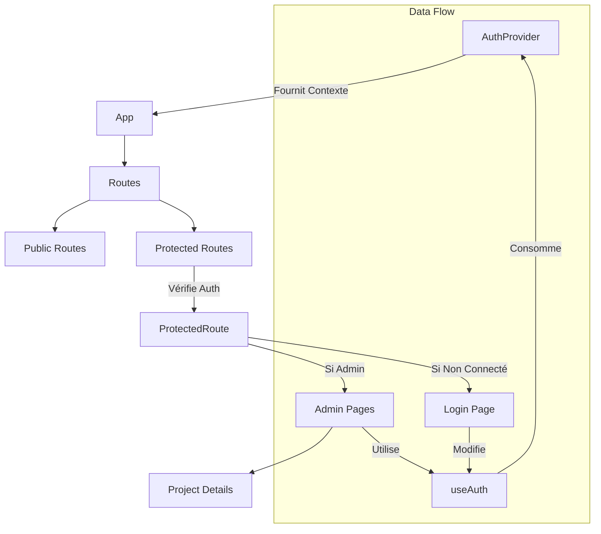

# Guide d'Implémentation : Authentification et Routes Imbriquées

Ce guide vous explique comment ajouter une fonctionnalité de connexion sécurisée à votre application React en utilisant `Context`, des `Hooks` personnalisés et `React Router`.

## Objectifs 🎯
1.  Gérer l'état de l'utilisateur (connecté/déconnecté) globalement avec **Context**.
2.  Créer un **Hook personnalisé** `useAuth` pour simplifier l'accès aux données.
3.  Protéger les routes d'administration via un composant wrapper.
4.  Maîtriser les Hooks avancés : `useParams`, `useEffect`, `useRef`.

---

## Vue d'Ensemble 🗺️

Voici comment les composants interagissent entre eux :



---

## Partie 1 : Authentification Simplifiée (`src/context/AuthContext.tsx`)

Nous utilisons un seul fichier pour tout gérer.

```tsx
import { createContext, useState, useEffect, useContext } from 'react';
import type { ReactNode } from 'react';

// ... (Code identique au précédent pour AuthContext)
```

*(Voir votre code source pour l'implémentation complète)*

---

## Partie 2 : Concepts Avancés 🚀

### 1. Routes Dynamiques avec `useParams`
Pour créer une page de détail (ex: `/admin/projects/123`), on utilise `useParams`.

**Configuration Route (`App.tsx`)** :
```tsx
<Route path="projects/:id" element={<AdminProjectDetails />} />
```

**Récupération ID (`AdminProjectDetails.tsx`)** :
```tsx
import { useParams } from 'react-router-dom';

export default function AdminProjectDetails() {
  const { id } = useParams(); // id vaudra "123"
  // ...
}
```

### 2. Le Cycle de Vie avec `useEffect`
Ce hook permet d'effectuer des actions à des moments précis.

- **Au montage seulement** (Comme `componentDidMount`) :
```tsx
useEffect(() => {
  console.log("Composant affiché !");
  fetchData();
}, []); // Tableau vide
```

- **Quand une variable change** :
```tsx
useEffect(() => {
  console.log("ID a changé :", id);
}, [id]); // Se relance si 'id' change
```

- **À chaque rendu** (Attention aux performances !) :
```tsx
useEffect(() => {
  console.log("Rendu !");
}); // Pas de tableau
```

- **Nettoyage** (Comme `componentWillUnmount`) :
```tsx
useEffect(() => {
  return () => {
    console.log("Composant détruit");
    // Annuler des abonnements ici
  };
}, []);
```

### 3. Références avec `useRef`
`useRef` a deux utilités principales :

1.  **Accéder au DOM** (ex: mettre le focus sur un input).
2.  **Stocker une valeur mutable** qui ne provoque pas de re-render quand on la change.

```tsx
const inputRef = useRef<HTMLInputElement>(null);

// Mettre le focus au chargement
useEffect(() => {
   if(inputRef.current) inputRef.current.focus();
}, []);

return <input ref={inputRef} />;
```

---

## Partie 3 : Architecture API & Bonnes Pratiques 🛠️

Pour garder le code propre, il est crucial de ne pas faire les appels `fetch` directement dans les composants.

### Architecture Recommandée
Nous avons créé un guide détaillé sur l'architecture API ici : [API_BEST_PRACTICES.md](./API_BEST_PRACTICES.md).

**En résumé :**
1.  **Services** : Tous les appels API sont dans `src/services/`.
2.  **Types** : Les interfaces TypeScript sont dans `src/types/`.
3.  **Token** : Le token est géré automatiquement par le wrapper `api.ts`.
4.  **Gestion d'erreur** : Centralisée pour éviter de répéter les `try/catch`.

Exemple d'utilisation avec le nouveau service :
```tsx
import { ProjectService } from '../services/project.service';

// Dans votre composant
useEffect(() => {
  ProjectService.getAll().then(data => setProjects(data));
}, []);
```

---


---

## Partie 4 : Comprendre le JWT (JSON Web Token) 🔑

Le **JWT** est un standard pour échanger des informations de manière sécurisée.
Il est composé de 3 parties séparées par des points (`.`) :

1.  **Header** : L'algo de cryptage (ex: HS256).
2.  **Payload** : Les données de l'utilisateur (id, email, expiration).
3.  **Signature** : Assure que le token n'a pas été modifié.

**Flux d'authentification :**
1.  L'utilisateur envoie email/password au serveur.
2.  Le serveur vérifie et renvoie un **Token** signé.
3.  Le client stocke ce Token (localStorage ou Cookie).
4.  Pour chaque requête suivante, le client envoie le Token dans le header `Authorization`.

### Décodage Côté Client (`src/utils/jwt.ts`)
Nous ne pouvons pas vérifier la signature (seul le serveur a la clé secrète), mais nous pouvons **décoder** le payload pour afficher le nom ou vérifier l'expiration.

```typescript
// Exemple de fonction de décodage simple (base64)
export function decodeJWT(token) {
  const payload = token.split('.')[1];
  return JSON.parse(atob(payload));
}
```

---

## Partie 5 : WebServices et CRUD 📡

Le **CRUD** (Create, Read, Update, Delete) est la base des applications web.

### Architecture Service
Pour éviter de dupliquer le code `fetch`, on utilise des **Services**.

**Exemple : `ProjectService`**
- **GET** (Read) : `client.get('/projects')`
- **POST** (Create) : `client.post('/projects', data)`
- **PUT** (Update) : `client.put('/projects/${id}', data)`
- **DELETE** (Delete) : `client.delete('/projects/${id}')`

### L'importance du Context
Le `Context` React sert à partager des données "globales" (Auth, Thème, Langue) sans passer les props manuellement à chaque étage ("Prop Drilling").

---

## Partie 6 : Le Hook useEffect en Détail 🎣

`useEffect` synchronise votre composant avec un système extérieur (API, DOM, Timer).

### Les 4 Mouvements du useEffect

1.  **Mounting (Démarrage)** : Le tableau de dépendances est vide `[]`.
    *Exemple : Charger des données au lancement.*
2.  **Updating (Mise à jour)** : Le tableau contient des variables `[id, user]`.
    *Exemple : Recharger les données quand l'ID change.*
3.  **Unmounting (Nettoyage)** : La fonction retourne une autre fonction.
    *Exemple : Couper une connexion WebSocket.*
4.  **No Dependency (Danger)** : Pas de tableau.
    *S'exécute à chaque rendu. À éviter sauf cas rares.*

```typescript
useEffect(() => {
  // 1. Code exécuté au montage ou update
  const timer = setInterval(() => console.log('Tic'), 1000);

  // 2. Fonction de nettoyage (exécutée avant le prochain effet ou au démontage)
  return () => {
    clearInterval(timer); // Important pour éviter les fuites de mémoire !
  };
}, []); // Tableau de dépendances
```

---

## Quiz de Validation 🧠

**Q1. Quelle partie du JWT contient les données utilisateur ?**
A) Header
B) Payload
C) Signature

**Q2. Que signifie CRUD ?**
A) Create, Read, Update, Delete
B) Code, Run, Unit, Debug
C) Connect, Request, User, Database

**Q3. Pourquoi utiliser un Service pour les appels API ?**
A) Pour rendre le code plus lent
B) Pour centraliser la logique et réutiliser le code
C) C'est obligatoire par React

**Q4. Si je veux exécuter un effet uniquement quand la variable `userId` change, que dois-je mettre dans le tableau de dépendances ?**
A) `[]`
B) `[userId]`
C) Rien du tout

**Q5. Comment envoyer le token au serveur de manière sécurisée ?**
A) Dans l'URL
B) Dans le header `Authorization: Bearer <token>`
C) Dans le body de chaque requête

**Q6. Que se passe-t-il si on oublie la fonction de nettoyage dans un `useEffect` qui crée un `setInterval` ?**
A) Rien de grave
B) Le timer continue de tourner indéfiniment (fuite de mémoire)
C) React plante immédiatement

**Q7. Quelle méthode de `React Router` permet de récupérer `:id` dans l'URL ?**
A) `useRoute`
B) `useParams`
C) `useHistory`

**Q8. `useRef` provoque-t-il un re-rendu du composant quand sa valeur change ?**
A) Oui
B) Non

**Q9. Dans quel fichier avons-nous centralisé la logique d'auth ?**
A) `src/hooks/useAuth.ts`
B) `src/context/AuthContext.tsx`
C) `src/App.js`

**Q10. Que faut-il faire si le token est expiré (401) ?**
A) Réessayer en boucle
B) Déconnecter l'utilisateur et le rediriger vers le Login
C) Ignorer l'erreur

---
*Réponses : 1B, 2A, 3B, 4B, 5B, 6B, 7B, 8B, 9B, 10B*
